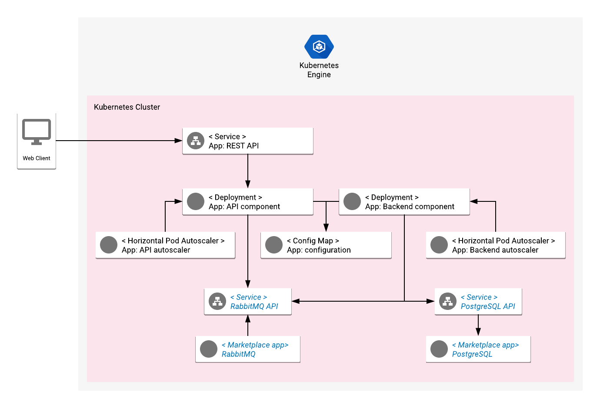

# Example K8s microservice using GCP Marketplace solutions

## Background

This is a Spring Boot based application designed to be run natively on Kubernetes
and show the capabilities of GCP Marketplace solutions.

We are going to deploy two open source applications offered on the Kubernetes Marketplace
(a part of GCP Marketplace) - RabbitMQ and PostgreSQL. Then we will run this application
including two simple microservices on Google Kubernetes Engine and integrate it with the
RabbitMQ and PostgreSQL installed from the Marketplace.



## Infrastructure setup

### Run RabbitMQ from GCP Marketplace

Navigate to [Click to Deploy RabbitMQ](https://console.cloud.google.com/marketplace/details/google/rabbitmq)
Kubernetes application and follow the on-screen instructions to configure and install 
a RabbitMQ cluster on Kubernetes.

#### (Optional) Create a dedicated user account

You may create a dedicated RabbitMQ user account to be used for application integration.
To create a user account, navigate to `http://[RABBITMQ_HOST]:15762/`, log in with username
`rabbit` and the password taken from the application screen in GKE UI. In the `Admin` tab
you can find the `Add a user` form.

### Run PostgreSQL from GCP Marketplace

Navigate to [Click to Deploy PostgreSQL](https://console.cloud.google.com/marketplace/details/google/postgresql)
Kubernetes application and follow the on-screen instructions to configure and install 
a PostgreSQL server on Kubernetes.

#### Create a dedicated user account and a database

Use the utility binaries shipped with with PostgreSQL installation to create
a user account (`createuser`) and a database (`createdb`). You can read the
`postgres` user password from the `Applications` screen of the GKE UI.

```shell
POSTGRES_HOST=...

# Create a new user: k8s-app
createuser -h "${POSTGRES_HOST}" -U postgres k8s-app

# Create a new database: k8s-app
createdb -h "${POSTGRES_HOST}" -U postgres k8s-app


# Use psql to set user's password and grant permissions to the database
psql -h "${POSTGRES_HOST}" -U postgres

postgres=# ALTER USER "k8s-app" WITH ENCRYPTED PASSWORD '[CUSTOM_PASSWORD]';
postgres=# GRANT ALL PRIVILEGES ON DATABASE "k8s-app" TO "k8s-app";
```

### Configure local environment to run Kubernetes deployment

We will use the Kubernetes cluster where RabbitMQ was deployed to run the deployment
of this application too. 

#### Authenticate to the cluster with `gcloud`

```shell
CLUSTER=<cluster name>
ZONE=<cluster zone>

gcloud container clusters get-credentials "$CLUSTER" --zone "$ZONE"
```

#### Create the `k8s-app` namespace

```shell
kubectl create namespace k8s-app
``` 

### Create a Kubernetes ConfigMap with the application configuration

RabbitMQ connection properties and credentials need to be configured in a ConfigMap
following the template from `manifests-setup/marketplace-env.yaml`.

Edit `manifests-setup/marketplace-env.yaml` to store the proper information
pointing to the RabbitMQ cluster. Run the creation of the ConfigMap:

```shell
kubectl apply -n k8s-app -f manifests-setup/marketplafce-env.yaml
```

### Build the application containers

Build the containers with cloud build and push them automatically to Google Container Registry:

```shell
gcloud builds submit .
```

### Run the installation of your app in K8s

```shell
kubectl apply -n k8s-app -f manifests-setup/
```

## Deployment result

As a result, you get your microservices connected to RabbitMQ and deployed to
autoscalable `Deployments`:
- an API component listening for HTTP connections on a REST endpoint and sending
  requests to the RabbitMQ topic,
- a backend component listening for incoming messages on a RabbitMQ queue and
  serving the incoming requests.
  
Navigate to the `Applications` tab of the GKE UI to see more information about
the resources created in the Kubernetes cluster and continue with the next steps.